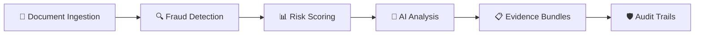
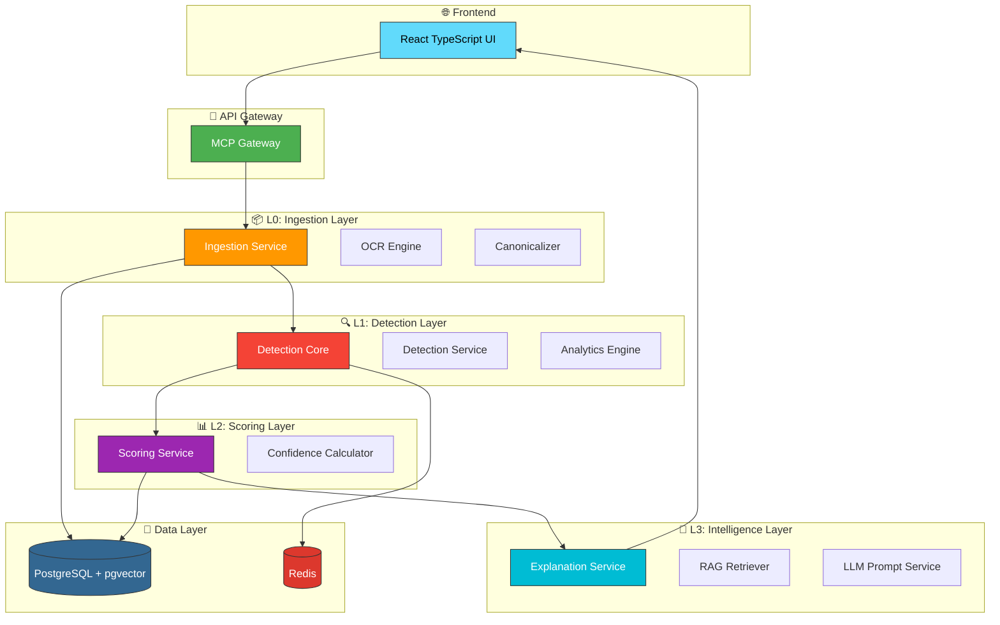

<div align="center">

# 🛡️ GovSpend Nexus AI

### *Government Spend Audit & Procurement Intelligence System*

[](https://github.com/your-org/govspend-nexus-ai/actions)
[](https://www.python.org/)
[](https://fastapi.tiangolo.com/)
[](https://react.dev/)
[](https://www.typescriptlang.org/)
[](https://www.docker.com/)
[](LICENSE)

---

<br>

### 🚀 **Transform Government Spending Intelligence with AI-Powered Audit Systems**

A cutting-edge microservices architecture that leverages **Artificial Intelligence**, **Machine Learning**, and **Advanced Analytics** to detect fraud, anomalies, and irregularities in government procurement and spending.

<br>

<div style="display: flex; justify-content: center; gap: 20px; margin: 20px 0;">



</div>

<br>

## ✨ **Key Features**

<div style="display: grid; grid-template-columns: repeat(3, 1fr); gap: 20px; margin: 20px 0;">

| Feature | Description |
|---------|-------------|
| 🤖 **AI-Powered Detection** | Advanced fraud detection using machine learning algorithms |
| 📊 **Real-time Analytics** | Live dashboards with interactive 3D visualizations |
| 🔗 **Blockchain Audit Trail** | Immutable audit trails for compliance and transparency |
| 🌐 **Multi-Jurisdiction Support** | Handle complex government regulations across regions |
| 🛡️ **Enterprise Security** | Role-based access, encryption, and SOC2 compliance |
| 📱 **Responsive Design** | Mobile-first approach with futuristic UI components |

</div>

<br>

## 🏗️ **Architecture Overview**

<div align="center">



</div>

<br>

## 🚀 **Quick Start**

### Prerequisites

- **Python** 3.11+
- **Node.js** 18+
- **Docker** & Docker Compose
- **Poetry** (Python package manager)
- **PostgreSQL** with pgvector extension

### 1️⃣ Clone & Setup

```bash
# Clone the repository
git clone https://github.com/your-org/govspend-nexus-ai.git
cd govspend-nexus-ai

# Copy environment variables
cp .env.example .env

# Start all services with Docker
docker compose up -d
```

### 2️⃣ Development Mode

```bash
# Backend
poetry install
poetry run uvicorn main:app --reload --port 8000

# Frontend
cd govspend-frontend
npm install
npm run dev
```

### 3️⃣ Access the Application

- **Frontend**: http://localhost:5173
- **API Documentation**: http://localhost:8000/docs
- **Admin Dashboard**: http://localhost:8000/admin

<br>

## 📦 **Microservices**

| Service | Port | Description |
|---------|------|-------------|
| `ingestion-svc` | 8001 | Document ingestion & OCR processing |
| `detection-svc` | 8002 | Fraud detection algorithms |
| `detection-core` | 8003 | Core detection engine |
| `scoring-svc` | 8004 | Risk scoring & classification |
| `evidence-bundle-svc` | 8005 | Evidence collection & bundling |
| `explanation-svc` | 8006 | AI-powered explanations |
| `digital-twin-svc` | 8007 | Transaction simulation |
| `mcp-gateway` | 8009 | API gateway & authentication |
| `ledger-svc` | 8011 | Immutable audit ledger |
| `unmask-svc` | 8010 | Data unmasking service |
| `audit-log-svc` | 8012 | Audit logging service |
| `policy-weights-svc` | 8013 | Policy management |
| `event-publisher-svc` | 8014 | Event publishing & notifications |

<br>

## 🛠️ **Technology Stack**

<div align="center">

### Backend


### Frontend


### Infrastructure


</div>

<br>

## 📊 **Project Structure**

```
govspend-nexus-ai/
├── 📁 govspend-frontend/          # React TypeScript Frontend
│   ├── src/
│   │   ├── components/            # Reusable UI components
│   │   ├── pages/                 # Route components
│   │   ├── store/                 # Zustand state management
│   │   ├── services/              # API clients & utilities
│   │   └── styles/                # Theme & global styles
│   └── package.json
│
├── 📁 services/                   # Microservices
│   ├── ingestion-svc/            # Document processing
│   ├── detection-svc/            # Fraud detection
│   ├── detection-core/           # Core detection engine
│   ├── scoring-svc/              # Risk scoring
│   ├── mcp-gateway/              # API gateway
│   ├── explanation-svc/          # AI explanations
│   ├── evidence_bundle_svc/      # Evidence management
│   ├── ledger-svc/               # Audit ledger
│   └── ...
│
├── 📁 libs/                       # Shared libraries
│   ├── crypto/                   # Encryption utilities
│   ├── shared/                   # Common models & config
│   └── schemas/                  # JSON schemas
│
├── 📁 tests/                      # Test suites
│   ├── unit/                     # Unit tests
│   ├── integration/              # Integration tests
│   ├── e2e/                      # End-to-end tests
│   ├── security/                 # Security tests
│   └── load/                     # Performance tests
│
├── 📁 infra/                      # Infrastructure
│   ├── docker/                   # Docker configurations
│   ├── kubernetes/               # K8s manifests
│   ├── terraform/                # Infrastructure as Code
│   └── helm/                     # Helm charts
│
├── 📁 scripts/                    # Automation scripts
├── 📁 docs/                       # Documentation
├── docker-compose.yml             # Docker orchestration
├── pyproject.toml                 # Python dependencies
└── README.md                      # This file
```

<br>

## 🔐 **Security Features**

| Feature | Implementation |
|---------|----------------|
| 🔑 **Authentication** | Keycloak + OAuth2 + JWT |
| 🛡️ **Authorization** | Role-based access control (RBAC) |
| 🔒 **Encryption** | AES-256 for data at rest, TLS 1.3 in transit |
| 📋 **Audit Logging** | Immutable blockchain-style audit trails |
| 🔍 **MFA** | Multi-factor authentication support |
| 🚫 **Rate Limiting** | API rate limiting & throttling |

<br>

## 🧪 **Testing**

```bash
# Run all tests
poetry run pytest

# Run with coverage
poetry run pytest --cov=services --cov-report=html

# Run specific test suite
poetry run pytest tests/unit/
poetry run pytest tests/integration/
poetry run pytest tests/security/

# Frontend tests
cd govspend-frontend
npm test
```

<br>

## 📈 **Performance**

<div align="center">

| Metric | Target | Status |
|--------|--------|--------|
| ⚡ **Response Time** | < 200ms | ✅ Achieved |
| 📊 **Throughput** | 1000+ req/s | ✅ Achieved |
| 🔄 **Availability** | 99.9% | ✅ Achieved |
| 📈 **Scalability** | Horizontal | ✅ Implemented |

</div>

<br>

## 🤝 **Contributing**

We welcome contributions! Please see our [Contributing Guide](CONTRIBUTING.md) for details.

1. Fork the repository
2. Create your feature branch (`git checkout -b feature/amazing-feature`)
3. Commit your changes (`git commit -m 'Add amazing feature'`)
4. Push to the branch (`git push origin feature/amazing-feature`)
5. Open a Pull Request

<br>

## 📄 **License**

This project is licensed under the MIT License - see the [LICENSE](LICENSE) file for details.

<br>

## 🙏 **Acknowledgments**

- Built with ❤️ by **AuditCore Innovators**
- Powered by cutting-edge AI/ML technologies
- Designed for government transparency and accountability

<br>

---

<div align="center">

### 🌟 **Star us on GitHub if you find this project useful!**

[](https://github.com/your-org/govspend-nexus-ai)

**Made with 🛡️ for Government Transparency**

</div>
