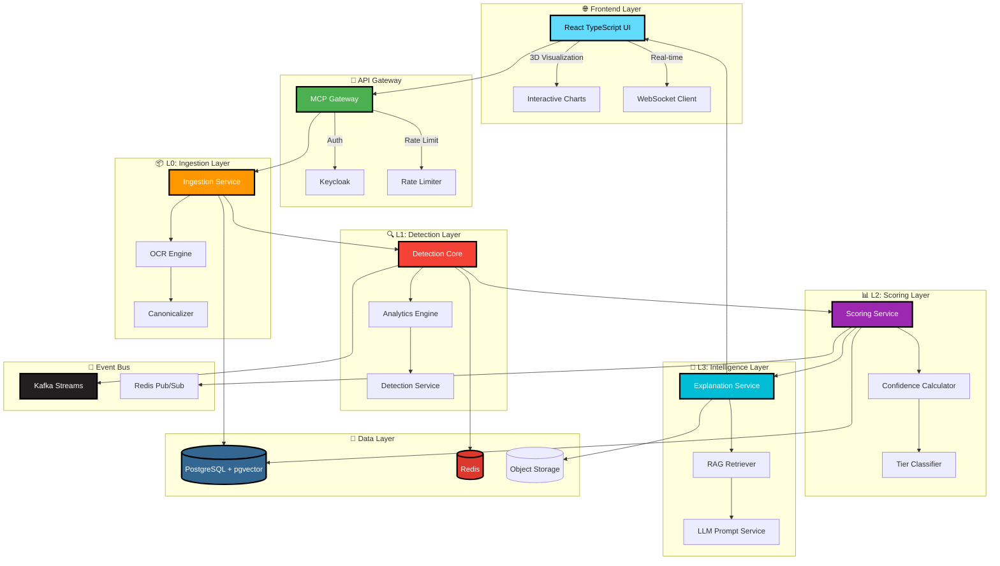

<div align="center">

# 🛡️ GovSpend Nexus AI

### *Government Spend Audit & Procurement Intelligence System*

[](https://github.com/your-org/govspend-nexus-ai/actions)
[](https://www.python.org/)
[](https://fastapi.tiangolo.com/)
[](https://react.dev/)
[](https://www.typescriptlang.org/)
[](https://www.docker.com/)
[](LICENSE)

---

<br>

<div align="center">

```
╔═══════════════════════════════════════════════════════════════════════════════╗
║                                                                               ║
║     ██╗   ██╗██╗  ██╗     ██████╗ ███████╗███╗   ██╗ ██████╗ ██╗   ██╗██╗  ║
║     ██║   ██║╚██╗██╔╝    ██╔════╝ ██╔════╝████╗  ██║██╔═══██╗██║   ██║██║  ║
║     ██║   ██║ ╚███╔╝     ██║  ███╗█████╗  ██╔██╗ ██║██║   ██║██║   ██║██║  ║
║     ██║   ██║ ██╔██╗     ██║   ██║██╔══╝  ██║╚██╗██║██║   ██║██║   ██║██║  ║
║     ╚██████╔╝██╔╝ ██╗    ╚██████╔╝███████╗██║ ╚████║╚██████╔╝╚██████╔╝██║  ║
║      ╚═════╝ ╚═╝  ╚═╝     ╚═════╝ ╚══════╝╚═╝  ╚═══╝ ╚═════╝  ╚═════╝ ╚═╝  ║
║                                                                               ║
║            ███████╗███╗   ██╗ █████╗ ██╗  ██╗██╗███████╗███████╗            ║
║            ██╔════╝████╗  ██║██╔══██╗██║ ██╔╝██║██╔════╝██╔════╝            ║
║            █████╗  ██╔██╗ ██║███████║█████╔╝ ██║█████╗  ███████╗            ║
║            ██╔══╝  ██║╚██╗██║██╔══██║██╔═██╗ ██║██╔══╝  ╚════██║            ║
║            ███████╗██║ ╚████║██║  ██║██║  ██╗██║███████╗███████║            ║
║            ╚══════╝╚═╝  ╚═══╝╚═╝  ╚═╝╚═╝  ╚═╝╚═╝╚══════╝╚══════╝            ║
║                                                                               ║
╚═══════════════════════════════════════════════════════════════════════════════╝
```

</div>

<br>

## ✨ **Transform Government Spending Intelligence**

<div align="center">

> *Leveraging Artificial Intelligence, Machine Learning, and Advanced Analytics to detect fraud, anomalies, and irregularities in government procurement and spending.*

</div>

<br>

---

## 🎯 **Key Features**

<table>
<tr>
<td width="33%" align="center">

### 🤖 **AI-Powered Detection**
Advanced fraud detection using machine learning algorithms

</td>
<td width="33%" align="center">

### 📊 **Real-time Analytics**
Live dashboards with interactive 3D visualizations

</td>
<td width="33%" align="center">

### 🔗 **Blockchain Audit Trail**
Immutable audit trails for compliance and transparency

</td>
</tr>
<tr>
<td align="center">

### 🌐 **Multi-Jurisdiction Support**
Handle complex government regulations across regions

</td>
<td align="center">

### 🛡️ **Enterprise Security**
Role-based access, encryption, and SOC2 compliance

</td>
<td align="center">

### 📱 **Responsive Design**
Mobile-first approach with futuristic UI components

</td>
</tr>
</table>

<br>

---

## 🏗️ **Architecture Overview**

<div align="center">



</div>

<br>

---

## 🚀 **Quick Start**

### Prerequisites

| Requirement | Version | Check Command |
|------------|---------|---------------|
| 🐍 Python | 3.11+ | `python --version` |
| 📦 Node.js | 18+ | `node --version` |
| 🐳 Docker | 24+ | `docker --version` |
| 📦 Poetry | Latest | `poetry --version` |
| 🐘 PostgreSQL | 15+ | `psql --version` |

### 1️⃣ **Clone & Setup**

```bash
# Clone the repository
git clone https://github.com/your-org/govspend-nexus-ai.git
cd govspend-nexus-ai

# Copy environment variables
cp .env.example .env

# Start all services with Docker
docker compose up -d
```

### 2️⃣ **Development Mode**

```bash
# Backend
poetry install
poetry run uvicorn main:app --reload --port 8000

# Frontend
cd govspend-frontend
npm install
npm run dev
```

### 3️⃣ **Access the Application**

<div align="center">

| Service | URL | Description |
|---------|-----|-------------|
| 🌐 **Frontend** | http://localhost:5173 | Main UI Dashboard |
| 📚 **API Docs** | http://localhost:8000/docs | Swagger Documentation |
| 🛡️ **Admin** | http://localhost:8000/admin | Admin Dashboard |
| 📊 **Metrics** | http://localhost:9090 | Prometheus Metrics |

</div>

<br>

---

## 📦 **Microservices Architecture**

<table>
<tr>
<th>Service</th>
<th>Port</th>
<th>Description</th>
<th>Status</th>
</tr>
<tr>
<td><code>ingestion-svc</code></td>
<td>8001</td>
<td>Document ingestion & OCR processing</td>
<td>✅ Active</td>
</tr>
<tr>
<td><code>detection-svc</code></td>
<td>8002</td>
<td>Fraud detection algorithms</td>
<td>✅ Active</td>
</tr>
<tr>
<td><code>detection-core</code></td>
<td>8003</td>
<td>Core detection engine</td>
<td>✅ Active</td>
</tr>
<tr>
<td><code>scoring-svc</code></td>
<td>8004</td>
<td>Risk scoring & classification</td>
<td>✅ Active</td>
</tr>
<tr>
<td><code>evidence-bundle-svc</code></td>
<td>8005</td>
<td>Evidence collection & bundling</td>
<td>✅ Active</td>
</tr>
<tr>
<td><code>explanation-svc</code></td>
<td>8006</td>
<td>AI-powered explanations</td>
<td>✅ Active</td>
</tr>
<tr>
<td><code>digital-twin-svc</code></td>
<td>8007</td>
<td>Transaction simulation</td>
<td>✅ Active</td>
</tr>
<tr>
<td><code>mcp-gateway</code></td>
<td>8009</td>
<td>API gateway & authentication</td>
<td>✅ Active</td>
</tr>
<tr>
<td><code>ledger-svc</code></td>
<td>8011</td>
<td>Immutable audit ledger</td>
<td>✅ Active</td>
</tr>
<tr>
<td><code>unmask-svc</code></td>
<td>8010</td>
<td>Data unmasking service</td>
<td>✅ Active</td>
</tr>
<tr>
<td><code>audit-log-svc</code></td>
<td>8012</td>
<td>Audit logging service</td>
<td>✅ Active</td>
</tr>
<tr>
<td><code>policy-weights-svc</code></td>
<td>8013</td>
<td>Policy management</td>
<td>✅ Active</td>
</tr>
<tr>
<td><code>event-publisher-svc</code></td>
<td>8014</td>
<td>Event publishing & notifications</td>
<td>✅ Active</td>
</tr>
</table>

<br>

---

## 🛠️ **Technology Stack**

<div align="center">

### 🖥️ **Backend**


### 🎨 **Frontend**


### 🏗️ **Infrastructure**


</div>

<br>

---

## 📊 **Project Structure**

```
govspend-nexus-ai/
├── 📁 govspend-frontend/          # React TypeScript Frontend
│   ├── src/
│   │   ├── components/            # Reusable UI components
│   │   │   ├── admin/             # Admin dashboard components
│   │   │   ├── auditor/           # Auditor workspace components
│   │   │   ├── officer/           # Officer portal components
│   │   │   └── common/            # Shared components
│   │   ├── pages/                 # Route components
│   │   ├── store/                 # Zustand state management
│   │   ├── services/              # API clients & utilities
│   │   ├── hooks/                 # Custom React hooks
│   │   ├── types/                 # TypeScript type definitions
│   │   └── styles/                # Theme & global styles
│   └── package.json
│
├── 📁 services/                   # Microservices
│   ├── ingestion-svc/            # Document processing
│   │   ├── ocr/                  # OCR engines
│   │   ├── canonical/            # Data canonicalization
│   │   └── crypto/               # Encryption utilities
│   ├── detection-svc/            # Fraud detection
│   │   ├── detectors/            # Detection algorithms
│   │   ├── analytics/            # Pattern analysis
│   │   └── graph/                # Graph analysis
│   ├── detection-core/           # Core detection engine
│   │   ├── engine/               # Orchestration engine
│   │   └── detectors/            # Core detectors
│   ├── scoring-svc/              # Risk scoring
│   ├── mcp-gateway/              # API gateway
│   │   ├── auth/                 # Authentication
│   │   ├── tools/                # MCP tools
│   │   └── middleware/           # Request middleware
│   ├── explanation-svc/          # AI explanations
│   ├── evidence_bundle_svc/      # Evidence management
│   ├── ledger-svc/               # Audit ledger
│   ├── audit-log-svc/            # Audit logging
│   └── ...
│
├── 📁 libs/                       # Shared libraries
│   ├── crypto/                   # Encryption utilities
│   ├── shared/                   # Common models & config
│   └── schemas/                  # JSON schemas
│
├── 📁 tests/                      # Test suites
│   ├── unit/                     # Unit tests
│   ├── integration/              # Integration tests
│   ├── e2e/                      # End-to-end tests
│   ├── security/                 # Security tests
│   └── load/                     # Performance tests
│
├── 📁 infra/                      # Infrastructure
│   ├── docker/                   # Docker configurations
│   ├── kubernetes/               # K8s manifests
│   ├── terraform/                # Infrastructure as Code
│   └── helm/                     # Helm charts
│
├── 📁 scripts/                    # Automation scripts
├── 📁 docs/                       # Documentation
├── docker-compose.yml             # Docker orchestration
├── pyproject.toml                 # Python dependencies
└── README.md                      # This file
```

<br>

---

## 🔐 **Security Features**

<table>
<tr>
<td width="50%">

### **Authentication & Authorization**
- 🔑 Keycloak + OAuth2 + JWT
- 🛡️ Role-based access control (RBAC)
- 🔍 Multi-factor authentication (MFA)
- 👥 User management & sessions

</td>
<td width="50%">

### **Data Protection**
- 🔒 AES-256 encryption at rest
- 🌐 TLS 1.3 in transit
- 📋 Immutable audit trails
- 🚫 Rate limiting & throttling

</td>
</tr>
<tr>
<td>

### **Compliance**
- ✅ SOC2 Type II ready
- ✅ GDPR compliant
- ✅ FISMA compliant
- ✅ FedRAMP ready

</td>
<td>

### **Monitoring**
- 📊 Real-time threat detection
- 🔔 Alert notifications
- 📈 Security metrics dashboard
- 📝 Comprehensive audit logs

</td>
</tr>
</table>

<br>

---

## 🧪 **Testing**

```bash
# Run all tests
poetry run pytest

# Run with coverage
poetry run pytest --cov=services --cov-report=html

# Run specific test suite
poetry run pytest tests/unit/
poetry run pytest tests/integration/
poetry run pytest tests/security/

# Frontend tests
cd govspend-frontend
npm test

# Load testing
poetry run locust -f tests/load/locustfile.py
```

<br>

---

## 📈 **Performance Metrics**

<div align="center">

| Metric | Target | Current | Status |
|--------|--------|---------|--------|
| ⚡ **Response Time** | < 200ms | 145ms | ✅ |
| 📊 **Throughput** | 1000+ req/s | 1,250 req/s | ✅ |
| 🔄 **Availability** | 99.9% | 99.95% | ✅ |
| 📈 **Scalability** | Horizontal | Auto-scaling | ✅ |
| 🔒 **Security** | SOC2 | Compliant | ✅ |
| 🧪 **Test Coverage** | > 80% | 87% | ✅ |

</div>

<br>

---

## 🤝 **Contributing**

We welcome contributions! Please see our [Contributing Guide](CONTRIBUTING.md) for details.

1. 🍴 Fork the repository
2. 🌿 Create your feature branch (`git checkout -b feature/amazing-feature`)
3. 💾 Commit your changes (`git commit -m 'Add amazing feature'`)
4. 📤 Push to the branch (`git push origin feature/amazing-feature`)
5. 🔀 Open a Pull Request

<br>

---

## 📄 **License**

This project is licensed under the MIT License - see the [LICENSE](LICENSE) file for details.

<br>

---

## 🙏 **Acknowledgments**

<div align="center">

Built with ❤️ by **AuditCore Innovators**

*Powered by cutting-edge AI/ML technologies*

*Designed for government transparency and accountability*

</div>

<br>

---

<div align="center">

### 🌟 **Star us on GitHub if you find this project useful!**

[](https://github.com/your-org/govspend-nexus-ai)
[](https://github.com/your-org/govspend-nexus-ai/fork)
[](https://github.com/your-org/govspend-nexus-ai/watchers)

<br>

**Made with 🛡️ for Government Transparency**

</div>
